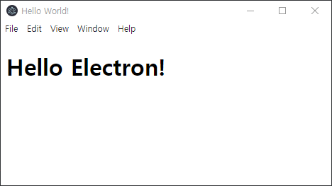
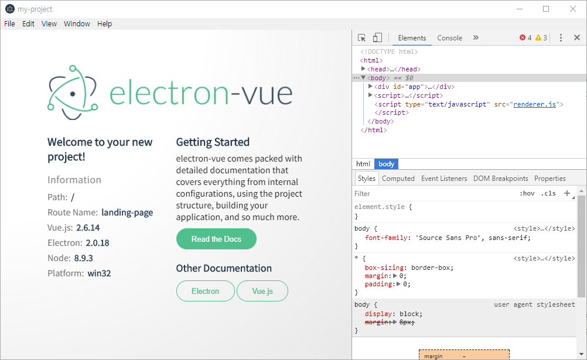

# Vue + Electron


## 1. Electron 해보고 싶었어!

&nbsp;&nbsp;최근에 이직한 회사에서 데스크탑 앱 서비스에 관심을 보이길래.<br>
&nbsp;&nbsp;당당하게 외쳤다.

> Electron !

## 2. Hello Electron!

&nbsp;&nbsp;[electron-quick-start](https://www.electronjs.org/docs/latest/tutorial/quick-start)를 이용해서 바로 시작해봤다. 역시 데스크탑 생태계 최상위 포식자답게 상세한 문서와 스타터팩을 지원한다. 한가지 아쉬운 점은 한글 문서가 없다는 점이다. ~~대한민국 일렉트론 개발자들 각성하라.~~


> &nbsp;
> 
> <br>
> <i>Hello Electron!</i>
> &nbsp;

## 3. Vue 와의 궁합.

> JavaScript is EVERYWHERE !


&nbsp;&nbsp;최근 웹개발 트렌드가 서버에서 클라이언트 쪽으로 대부분의 비즈니스 로직이 넘어오면서. 프론트엔드 프레임워크들의 위상이 매우 높아졌다. (React, Vue, ~~Angu어쩌구~~ 그리고 Svelte)<br>
&nbsp;&nbsp;대부분의 서비스는 인터페이스는 이제 웹 기술로 구현 하는게 요즘 추세이다. 덕분에 프론트엔드 개발자인 나에게 먹거리가 끊임없이 나올거같은 느낌이다.<br>
&nbsp;&nbsp;이번에 얘기할 Electron 도 결국은 웹 기술을 이용한 **데스크탑 앱**을 만드는 기술이다.<br>

&nbsp;&nbsp;뼈속부터 Vue 개발자인 나는 프론트 스펙은 무조건 Vue를 채택한다. ~~React를 할 줄 모른다.~~


#### 2-1. electron-vue

&nbsp;&nbsp;여러 자료 중 가장 눈에 띄는 자료는 [electron-vue](https://simulatedgreg.gitbooks.io/electron-vue/content/ko/)였다.

> <i>vue로 구축 된 electron 애플리케이션을 만들기 위한 보일러 플레이트</i>

바로 클론 받고 감탄하는 순간. 이게 웬걸?

> &nbsp;
> 
> <br>
> Electron 버전이 2 ... ?
> &nbsp;

현재 시점으로 Electron stable 은 13이다.. (18까지도 개발 중) 버전이 너무 ~~구닥다리~~라서 바로 손절했다.

#### 2-2. Vue + Electron Builder

&nbsp;&nbsp;앞서 얘기한 electron-vue가 Electron 위에 Vue 를 올린 느낌이라면. [Electron Builder](https://www.electron.build/) 는 기존 NPM 프로젝트에 electron 을 씌우는 느낌이다.
&nbsp;&nbsp;Vue에서는 정말 유용하게도 Vue CLI 에서 지원해준다. (정말 최고!)

[Vue CLI Plugin Electron Builder](https://nklayman.github.io/vue-cli-plugin-electron-builder/)

&nbsp;&nbsp;기존 프로젝트에 해당 라이브러리만 추가해주면 된다. 정말 쉽다.
```bash
$ vue add electron-builder
```

대단하다고 느낀게, 기존 Vue 프로젝트에 해당 라이브러리만 추가해주면 일렉트론으로 서비스를 실행할 수 있다.
> &nbsp;
> 
> <br>
> 기존 Vue 프로젝트를 쉽게 Electron 으로 띄웠다.
> &nbsp;

웹 서비스를 데스크탑 앱 서비스로 당장 런칭하고 싶다면, 이 방법을 적극 추천할 것이다.
