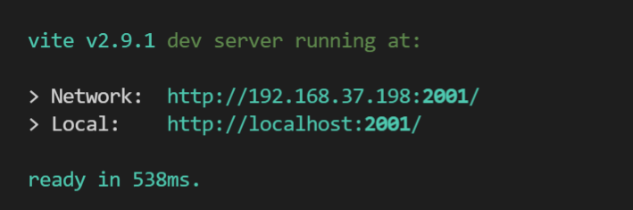
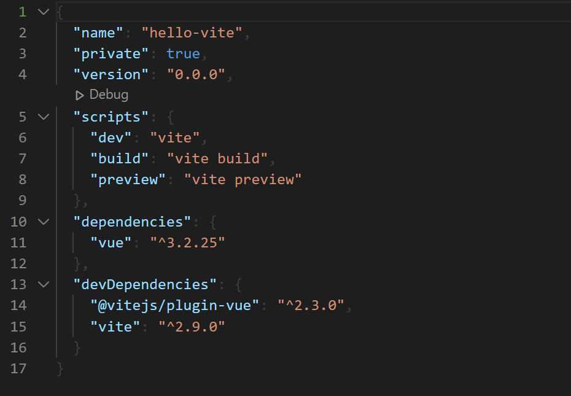
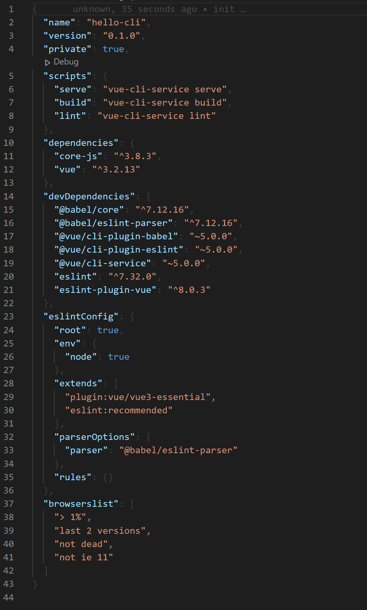

# Migrating from Vue CLI to Vite

## Vue CLI 에서 Vite 로 변환기

> &nbsp;
>
> 
>
> *"뭐라고? 빌드하는데 0.5초..?!"*
> &nbsp;


## 0. Vite, 얼마나 빠르길래?

&nbsp;&nbsp; 이전 회사 Vue 프로젝트는 개발 빌드 하는데 50초가 걸렸다.. ~~(커피라도 타와야되나)~~

## 1. Hello Vite!

&nbsp;&nbsp;[Scaffolding Your First Vite Project](https://vitejs.dev/guide/#scaffolding-your-first-vite-project) 공식 홈페이지를 따라 바로 만들어보자.
&nbsp;&nbsp;역시 뼛속부터 Vue 개발자인 나는 무조건 Vue 로 선택했다.

```bash
# npm 7+, extra double-dash is needed:
$ npm create vite@latest my-vue-app -- --template vue

Done. Now run:

  cd hello-vite
  npm install
  npm run dev
```
&nbsp;&nbsp; 프로젝트가 만들어지는 속도에서 이미 놀랐다. 물론, 프로젝트 세팅 선택영역이 없는 것도 한 몫한다.

#### 1-1. packages.json
> 
> 
> <br>
> Vite(왼쪽), CLI(오른쪽) Default Vue3 기준.<br>
> 한 눈에 봐도 의존성 갯수에서 차이가 느껴진다. 그만큼 가볍다.
> &nbsp;

## 2. webpack-to-vite.

#### 2-0. Brilliant LEGACY.
&nbsp;&nbsp;나는 지금까지 많은 신기술들을 소개할 때, 이게 짱짱 좋으니 다음 프로젝트에선 이걸 도입해봐! 라는 식이 많았다. 하지만 현실은 그렇지 않다. 기존 프로젝트도 버거운걸!

#### 5. 참고자료
 -