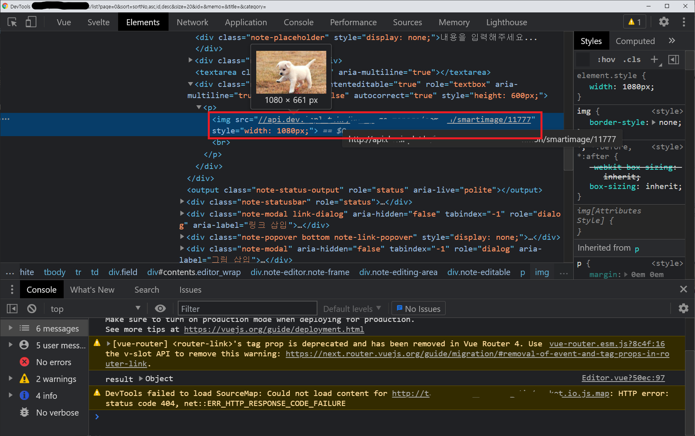

# Uploaing Images on the open source WYSIWYG.
## "오픈소스 위지위그에 이미지 올리기" 개발일지.

> &nbsp;
> 
>
> *"에디터에 사진을 추가했더니 게시글 데이터가 미친듯이 올라갔어요 !"*

## 1. Situation 🔍
[Summernote](https://summernote.org/) 를 비롯한 대부분의 오픈소스 위지위그 에디터에 이미지를 첨부하면 **base64로 인코딩** 되면서 첨부된다.<br>
단순한 이미지 1개를 첨부한게 위 상황이다.

<s>저런게 2개, 3개.. 10개 이상이라면..?</s> 🤮

## 2. Issue 💢

저렇게 엄청난 문자열 데이터를 데이터 베이스에 때려 넣는 것도 썩 좋지 않은데,
RDB(MySQL)인 경우 **데이터베이스 맥스 패킷이 초과**돼서 SELECT를 할 수 없는 상황이 발생된다.

## 3. Solution 🔨
해결방법은 여러가지다.

1. MySQL 컨텐츠 필드 데이터 타입을 (varchar, Text, LongText) -> **Blob** 으로 변경
2. Text 데이터 타입을 쓰려면, MySQL Database **max_allowed_packet** 를 넉넉하게 올린다. (<s>매우 권장하지 않음</s>)
3. AWS S3, MINIO 같은 **스토리지 서버에 이미지를 저장**하고, 그 이미지를 API GET 하는 방법이다.

우리가 알아볼 방법은 세번째 방법이다.

## 4. Process 📑
간단한 프로세스는 이렇다.

1. 이미지 첨부
2. 스토리지 서버에 저장
3. **이미지 태그로 치환 (중요 포인트)**

### 4-1. support
"이미지 태그로 치환" 이 부분은 에디터단에서 지원해주는게 중요하다.<br>
만약 위 프로세스대로 진행하려는데, 에디터에서 해당 기능을 지원해주지 않는다면.. <s>매우 고생할 것이다.</s><br>  🤦🤦‍♂️

그렇기 때문에 시중에 있는 오픈소스 위지위그 에디터를 채택할 때 **해당 기능을 지원 해주는지 반드시 고려**해봐야한다.

### 4-2. then..

> &nbsp;
> 
>
> *"이미지 태그 " &lt;img&gt; " 하나로 불러오니깐 깔끔하네 !"*

# HOW TO
이번 일지에선 두 가지 에디터에서 내가 개발한 방식을 소개한다.

<hr>
## 1. Summernote

#### Just Try it !
[썸머노트 공식 홈페이지](https://summernote.org/)에서 이미지 업로드를 해보자.<br>
*base64*로 인코딩해서 올라가는걸 바로 확인할 수 있다.<br><br>

썸머노트는 아래와 같이 [onImageUpload 콜백 메소드](https://summernote.org/deep-dive/#onimageupload)로 이미지 업로드를 공식 지원해준다.

```js
// Override image upload handler(default: base64 dataURL on IMG tag). You can upload image to server or AWS

// onImageUpload callback
$('#summernote').summernote({
  callbacks: {
    onImageUpload: function(files) {
      // upload image to server and create imgNode...
      $summernote.summernote('insertNode', imgNode);
    }
  }
});

// summernote.image.upload
$('#summernote').on('summernote.image.upload', function(we, files) {
  // upload image to server and create imgNode...
  $summernote.summernote('insertNode', imgNode);
});
```

#### Let's Summernote !

이제 실제 코드로 썸머노트에 이미지 업로드 API 를 탑재해보자.

간단한 프로세스는 이렇다.
1. 썸머노트 에디터 생성
2. 에디터 생성할 때 이미지 업로드 콜백 메소드를 옵션으로 추가
3. 사용자가 에디터에서 이미지 업로드
4. 이미지 서비스에서 리턴받은 경로를 이미지 태그(**&lt;img src="[이미지 API GET URL]"&gt;**)로 만들어서  에디터에 컨텐츠에 추가

참고로 썸머노트는 *jQuery* 기반으로 동작한다.

```js
 1. summernoteInit () {
 2.   $('#editor').summernote({
 4.     // Editor Options
 5.     placeholder: '내용을 입력해주세요...',
 6.     tabsize: 2,
 7.     width: 200,
 8.     height: 100,
 9.     lang: 'ko-KR',
10.     toolbar: [],
11.     callbacks: {
12.       // onImageUpload Method
14.       onImageUpload: function (files) {
15.         uploadSummernoteImageFile(files[0], this)
16.       }
17.     }
18.   })
21. },
```

**Line 2.** 에디터를 DOM(#editor)에 집어넣는다.<br>
**Line 4 - 11.** 해당 에디터가 생성될 때 갖게 될 옵션(사이즈, 언어, 콜백 등)들을 나열한다.<br>
**Line 14.** 우리는 이미지 업로드 콜백 메소드(onImageUpload)를 사용한다.<br>

#### onImageUpload callback method
```js
/**
*
* @param { files } Array 파일 객체 리스트
*
*/
onImageUpload: function (files) {
  uploadImagesService(files[0], this)
}
```

에디터에서 사진을 추가하면 *onImageUpload* 이벤트가 실행되면서 파라미터로 파일 리스트가 넘어온다.
넘어온 파일 데이터를 이미지 서비스 API에 보내면 된다.

참고로 '*onImageUpload*'는 임의로 코딩한게 아니라 썸머노트에서 공식 지원해주는 메소드명이다.

#### uploadImagesService

이제 구축된 이미지 서비스에 파일을 업로드한다.
나는 [axios](https://github.com/axios/axios)를 이용해서 http POST 를 보냈다.

```js
/**
*
* @param { file } Object 파일 객체
* @param { editor } Object 에디터 객체
*
*/
uploadImagesService (file, editor) {
  let data = new FormData()
  data.append('uploadFile', file)

  let apiURL = `${이미지_서비스}/common/smartimage`

  this.$axios({
    method: 'post',
    url: apiURL,
    data
  }).then(result => {
    $(editor).summernote('insertImage', 이미지_URL)
  }).catch(error => {
    console.error(error)
  })
},
```

이제 이미지 서비스에서 리턴받은 URL 정보를 에디터 컨텐츠에 삽입해주면 끝이다.
썸머노트는 insertImage 로 자체적으로 처리해준다.

참 고마운 라이브러리다. 😁
#### insertImage
```js
$(editor).summernote('insertImage', 이미지_URL)
```

<hr>

## 2. Toast UI
